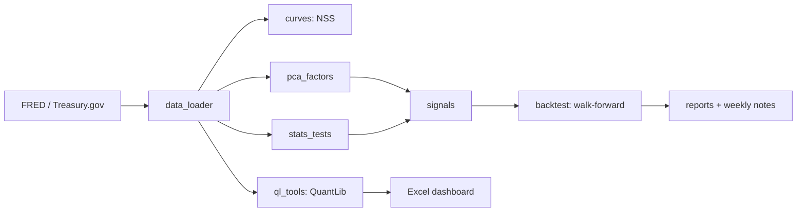

# Rates Strategy Lab: a 2s10s steepener research platform

Python research stack for US rates: Treasury curve construction (Nelson-Siegel-Svensson and a QuantLib
bootstrap), PCA factor analysis, bond analytics (DV01, duration, convexity), a SOFR swap scenario engine,
and a walk-forward backtest of a DV01-neutral 2s10s steepener, with an Excel/VBA risk dashboard and weekly
market notes.



## Headline result (out-of-sample, after costs)

> Fill this in from `reports/results.md` after a run on real FRED data. Report negative results honestly.

| Signal | OOS Sharpe | Max DD (bp) | Turnover/yr | Bootstrap 95% CI | Deflated Sharpe prob. |
|---|---|---|---|---|---|
| macro_residual | X | X | X | [X, X] | X |
| pca_slope | X | X | X | [X, X] | X |
| momentum (baseline) | X | X | X | [X, X] | X |


## Reproduce

```bash
python -m venv .venv && source .venv/bin/activate   # Windows: .venv\Scripts\Activate.ps1
pip install -r requirements.txt
cp .env.example .env                                  # add your FRED key
python -m rateslab.pipeline --source fred
pytest -q
```

## Method notes

- P&L unit is the bp-equivalent: dollars per $1 of DV01 per leg; the steepener earns +1 per bp 2s10s widens.
- Signals use data up to the close of day t; positions are held from t+1. Macro series are shifted by their publication lag.
- Walk-forward: 5-year training window picks entry/exit thresholds, next 6 months trade out-of-sample.
- Robustness: parameter heatmaps, in-sample vs out-of-sample Sharpe per fold, block bootstrap, circular-shift timing test, deflated Sharpe.
- References: Nelson & Siegel (1987), Svensson (1994), Newey & West (1987), Bailey & Lopez de Prado (2014).

## Limitations

- Daily close data only; no intraday execution or market impact.
- Costs are a flat assumption (0.25bp per leg); no repo specials or financing term structure.
- Carry ignores roll-down. Duration uses par-bond closed forms, not on-the-run CUSIP details.
- SOFR swap quotes are ILLUSTRATIVE (Treasury yields minus assumed swap spreads), not market data.
- Macro regression uses levels of trending variables; treat the signal as a research hypothesis, not a finding.
